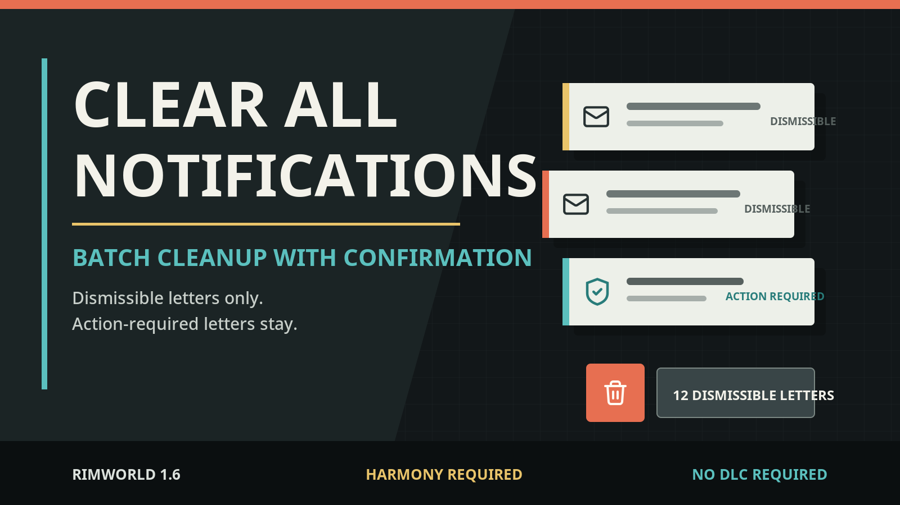
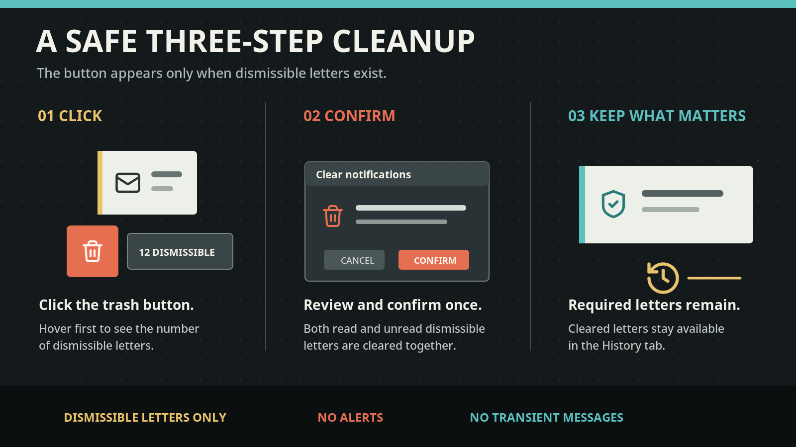
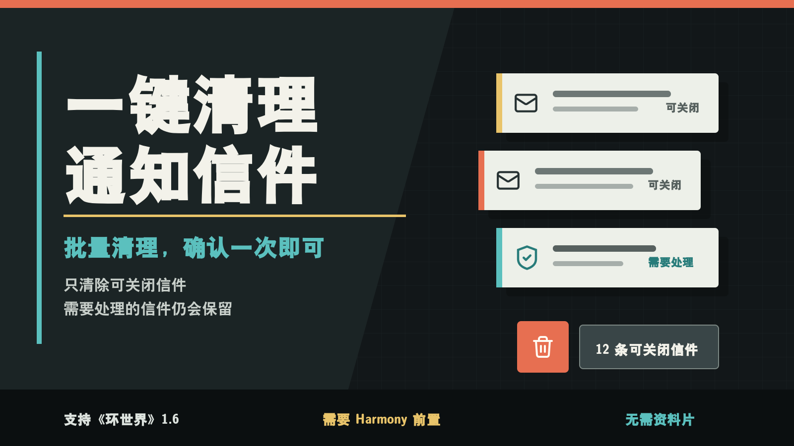
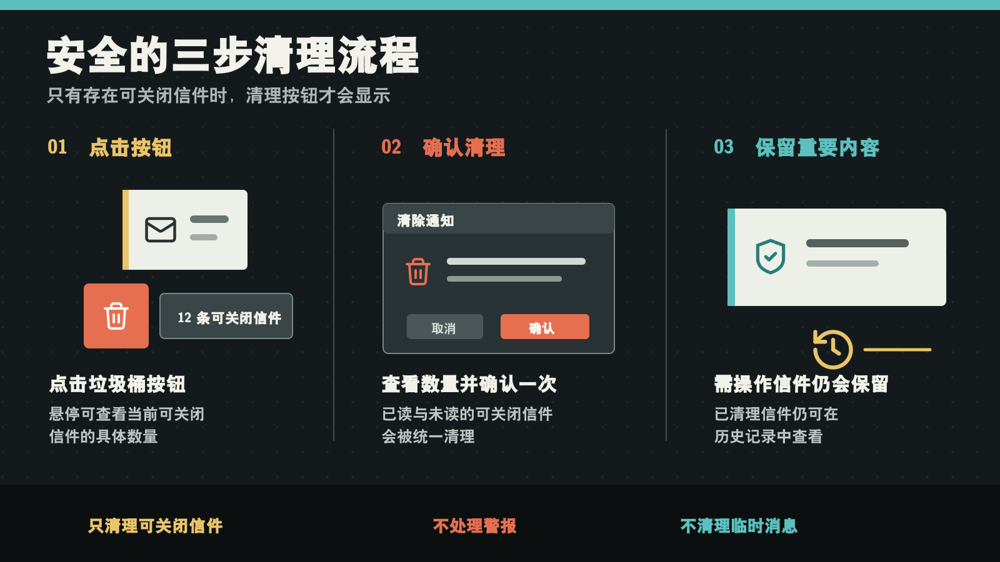

# Clear All Notifications

[](https://github.com/Juggernautsst/ClearAllNotifications/actions/workflows/build.yml)

## English



[Steam Workshop](https://steamcommunity.com/sharedfiles/filedetails/?id=3761571006) | [GitHub Releases](https://github.com/Juggernautsst/ClearAllNotifications/releases)

Clear accumulated RimWorld letters in one batch without losing their History records.

This lightweight UI mod adds a trash-can button to the top-right global controls. The button appears only when dismissible letters are present. Hover to see the count, click the button, then confirm the cleanup.



### Features

- Clears every current letter that RimWorld allows the player to dismiss with right-click.
- Preserves non-dismissible letters, including letters that require an action or choice.
- Keeps cleared letters available in the in-game History tab.
- Clears both read and unread dismissible letters in the same batch.

### Scope

- Does not clear top-left transient messages.
- Does not clear Alerts.
- Does not clear delayed letters that have not appeared yet.
- Provides no filters, settings, or hotkeys.

### Compatibility

- RimWorld 1.6.
- Requires Harmony, loaded before this mod.
- Includes English and Simplified Chinese.
- Requires no DLC.
- Stores no custom save data, so it can generally be added to or removed from an existing save.

Modded letters are handled according to whether their author permits vanilla right-click dismissal.

### Installation

Download `ClearAllNotifications-v*.zip` from [GitHub Releases](https://github.com/Juggernautsst/ClearAllNotifications/releases), extract the included `ClearAllNotifications` directory into `RimWorld/Mods`, then enable Harmony before this mod.

### Build

After installing the .NET SDK, run this command from the mod root:

```sh
dotnet build Source/ClearAllNotifications.csproj -c Release
```

The output DLL is written to `1.6/Assemblies/ClearAllNotifications.dll`.

You can also build directly against locally installed RimWorld and Harmony assemblies:

```powershell
dotnet build Source/ClearAllNotifications.csproj -c Release `
  -p:RimWorldDir="D:\steam\steamapps\common\RimWorld" `
  -p:HarmonyAssemblyPath="D:\steam\steamapps\workshop\content\294100\2009463077\Current\Assemblies\0Harmony.dll"
```

### License

[MIT](LICENSE)

---

## 简体中文



[Steam 创意工坊](https://steamcommunity.com/sharedfiles/filedetails/?id=3761571006) | [GitHub 发布页](https://github.com/Juggernautsst/ClearAllNotifications/releases)

一次确认，批量清理积累的 RimWorld 信件，同时保留历史记录。

本 Mod 会在右上角全局控制区添加一个垃圾桶按钮。只有存在可关闭信件时，按钮才会显示；悬停可查看数量，点击按钮并确认后即可统一清理。



### 功能

- 清除当前所有原版允许玩家右键关闭的信件。
- 保留不可关闭的信件，包括需要玩家操作或作出选择的信件。
- 已清理信件仍可在游戏的“历史记录”中查看。
- 已读与未读的可关闭信件会在同一批次中清理。

### 范围限制

- 不清除左上角临时消息。
- 不清除警报。
- 不清除尚未出现的延迟信件。
- 不提供筛选器、设置页面或快捷键。

### 兼容性

- 支持 RimWorld 1.6。
- 需要 Harmony，并应排在本 Mod 之前加载。
- 内置英文与简体中文。
- 不需要任何资料片。
- 不写入自定义存档数据，通常可以在已有存档中途添加或移除。

其他 Mod 添加的信件是否会被清理，取决于其作者是否允许玩家使用原版右键关闭功能。

### 安装

从 [GitHub 发布页](https://github.com/Juggernautsst/ClearAllNotifications/releases)下载 `ClearAllNotifications-v*.zip`，将其中的 `ClearAllNotifications` 目录解压到 `RimWorld/Mods`，然后先启用 Harmony，再启用本 Mod。

### 构建

安装 .NET SDK 后，在 Mod 根目录运行：

```sh
dotnet build Source/ClearAllNotifications.csproj -c Release
```

生成的 DLL 位于 `1.6/Assemblies/ClearAllNotifications.dll`。

也可以通过参数直接使用本机的 RimWorld 和 Harmony 程序集：

```powershell
dotnet build Source/ClearAllNotifications.csproj -c Release `
  -p:RimWorldDir="D:\steam\steamapps\common\RimWorld" `
  -p:HarmonyAssemblyPath="D:\steam\steamapps\workshop\content\294100\2009463077\Current\Assemblies\0Harmony.dll"
```

### 许可

[MIT](LICENSE)
