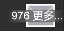

# Clear All Notifications

[](https://github.com/Juggernautsst/ClearAllNotifications/actions/workflows/build.yml)



为 RimWorld 1.6 添加一个右上角通知清理按钮。按钮只清除原版允许右键关闭的信件，需要玩家作出选择的信件会保留；已清除信件仍可在历史记录中查看。

Adds a top-right notification clear button for RimWorld 1.6. It removes only letters that vanilla allows the player to dismiss, keeps action-required letters, and leaves cleared letters available in History.

## 构建 / Build

安装 .NET SDK 后，在 Mod 根目录运行：

After installing the .NET SDK, run this command from the mod root:

```sh
dotnet build Source/ClearAllNotifications.csproj -c Release
```

生成的 DLL 位于 `1.6/Assemblies/ClearAllNotifications.dll`。运行游戏时还需要启用 Harmony。

The output DLL is written to `1.6/Assemblies/ClearAllNotifications.dll`. Harmony must also be enabled when running the game.

也可以通过参数直接使用本机的 RimWorld 和 Harmony 程序集：

You can also build directly against locally installed RimWorld and Harmony assemblies:

```powershell
dotnet build Source/ClearAllNotifications.csproj -c Release `
  -p:RimWorldDir="D:\steam\steamapps\common\RimWorld" `
  -p:HarmonyAssemblyPath="D:\steam\steamapps\workshop\content\294100\2009463077\Current\Assemblies\0Harmony.dll"
```

## 安装 / Install

普通用户请从 GitHub Releases 下载 `ClearAllNotifications-v*.zip`，将其中的 `ClearAllNotifications` 目录解压到 `RimWorld/Mods`，然后在 Mod 管理器中先启用 Harmony，再启用本 Mod。

For normal installation, download `ClearAllNotifications-v*.zip` from GitHub Releases and extract its `ClearAllNotifications` directory into `RimWorld/Mods`. Enable Harmony first, then enable this mod.

从源码构建时，可将整个仓库目录放入 `RimWorld/Mods`。

When building from source, the entire repository directory can be placed under `RimWorld/Mods`.

## 行为范围 / Scope

- 只清除原版允许右键关闭的信件，不会删除需要玩家选择的重要信件。
- 不清除左上角临时消息、Alerts 或尚未出现的延迟信件。
- 清除后的信件仍可在游戏的历史记录中查看。

- Clears only letters that vanilla permits the player to dismiss; action-required letters are preserved.
- Does not clear transient messages, Alerts, or delayed letters that have not appeared yet.
- Cleared letters remain available in the in-game History tab.

## 许可 / License

[MIT](LICENSE)
